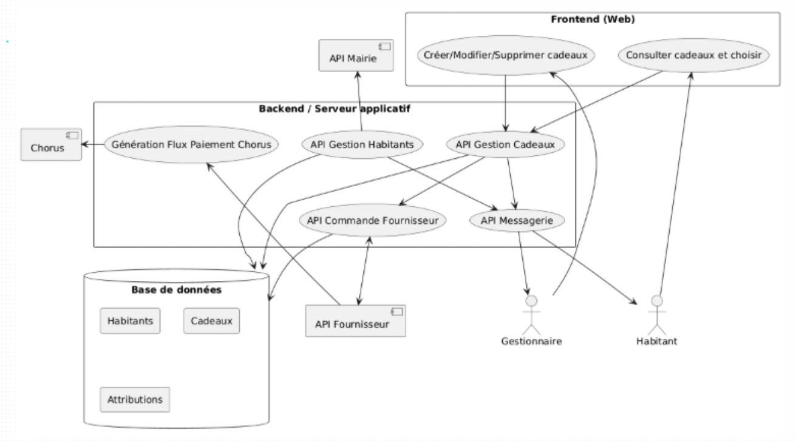
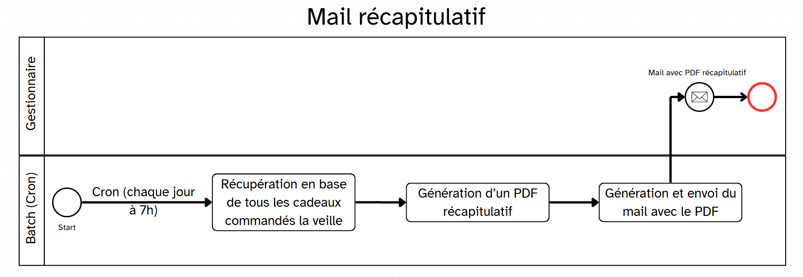
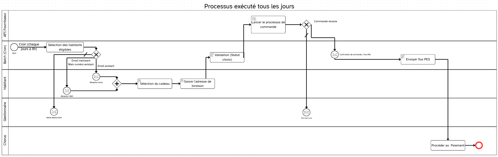
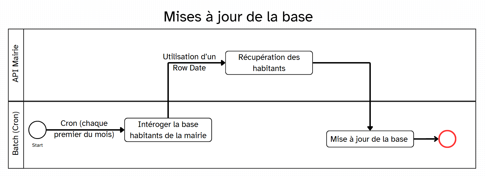
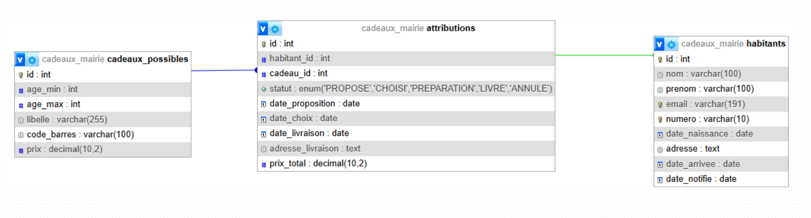

# HelloCitizen
HelloCitizen est une application développée en collaboration avec les mairies pour accueillir les nouveaux habitants.
Elle permet de :
- Identifier les nouveaux arrivants dans la commune.
- Suivre leur première année d’installation.
- Proposer automatiquement un cadeau symbolique à la fin de leur première année de résidence.
L’objectif est de renforcer le lien entre la mairie et ses citoyens, de valoriser l’accueil des nouveaux habitants et de favoriser leur intégration dans la vie locale.

-------

## Conception du projet

Vous trouverez ci-dessous les documents de conception détaillant l'architecture et les processus du projet. Cliquez sur un aperçu ou sur le titre pour ouvrir le PDF correspondant.

<h3>
  <a href="./Conception/Architecture_globale_du_SI.pdf">Architecture globale du SI</a>
</h3>

<h3>
  <a href="./Conception/BPMN_generation_du_recapitulatif_quotidien.pdf">BPMN - Génération du récapitulatif quotidien</a>
</h3>

<h3>
  <a href="./Conception/BPMN_gestion_des_cadeaux.pdf">BPMN - Gestion des cadeaux</a>
</h3>

<h3>
  <a href="./Conception/BPMN_maj_mensuelle_des_habitants.pdf">BPMN - Mise à jour mensuelle des habitants</a>
</h3>

<h3>
  <a href="./Conception/Cas_d'utilisation_Interface_de_l'habitant.pdf">Cas d'utilisation - Interface de l'habitant</a>
</h3>

<h3>
  <a href="./Conception/Cas_d'utilisation_Interface_du_gestionnaire.pdf">Cas d'utilisation - Interface du gestionnaire</a>
</h3>

<h3>
  <a href="./Conception/Structure_de_la_base_de_donnees.pdf">Structure de la base de données</a>
</h3>
