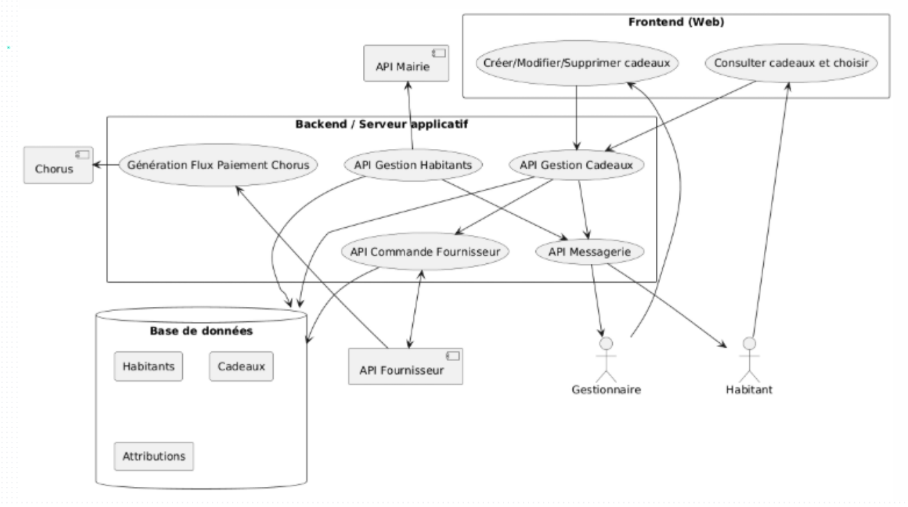
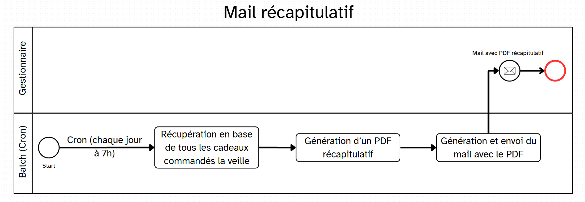
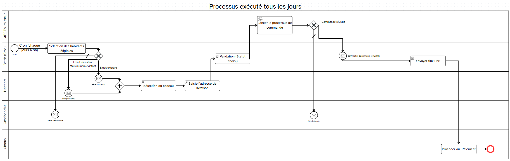
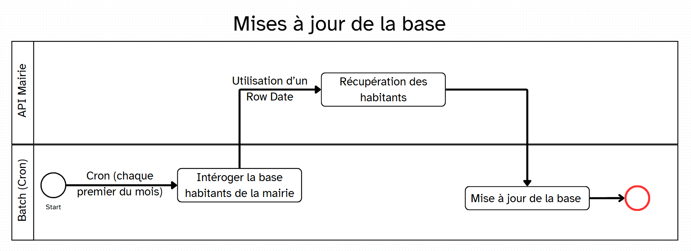
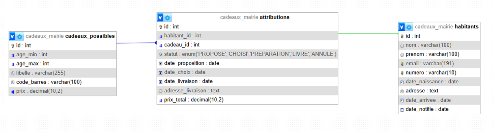

# HelloCitizen

HelloCitizen est une application développée en collaboration avec les mairies pour accueillir les nouveaux habitants.
Elle permet de :

- Identifier les nouveaux arrivants dans la commune.
- Suivre leur première année d’installation.
- Proposer automatiquement un cadeau symbolique à la fin de leur première année de résidence.
  L’objectif est de renforcer le lien entre la mairie et ses citoyens, de valoriser l’accueil des nouveaux habitants et de favoriser leur intégration dans la vie locale.

---

Plus sérieusement, voici notre dossier de conception avec l'explication de nos choix techniques. Vous y trouverez également une section détaillant nos endpoints ainsi qu'un tutoriel pour tester notre application.

## Conception du projet

Vous trouverez ci-dessous les documents de conception détaillant l'architecture et les processus du projet. Cliquez sur un aperçu ou sur le titre pour ouvrir le PDF correspondant.

<h3>
  <a href="./Conception/Architecture_globale_du_SI.pdf">Architecture globale du SI</a>
</h3>
<a href="./Conception/Architecture_globale_du_SI.pdf" title="Cliquer pour ouvrir le PDF">
  
</a>

<h3>
  <a href="./Conception/BPMN_generation_du_recapitulatif_quotidien.pdf">BPMN - Génération du récapitulatif quotidien</a>
</h3>
<a href="./Conception/BPMN_generation_du_recapitulatif_quotidien.pdf" title="Cliquer pour ouvrir le PDF">
  
</a>

<h3>
  <a href="./Conception/BPMN_gestion_des_cadeaux.pdf">BPMN - Gestion des cadeaux</a>
</h3>
<a href="./Conception/BPMN_gestion_des_cadeaux.pdf" title="Cliquer pour ouvrir le PDF">
  
</a>

<h3>
  <a href="./Conception/BPMN_maj_mensuelle_des_habitants.pdf">BPMN - Mise à jour mensuelle des habitants</a>
</h3>
<a href="./Conception/BPMN_maj_mensuelle_des_habitants.pdf" title="Cliquer pour ouvrir le PDF">
  
</a>

<h3>
  <a href="./Conception/Cas_d'utilisation_Interface_de_l'habitant.pdf">Cas d'utilisation - Interface de l'habitant</a>
</h3>
<a href="./Conception/Cas_d'utilisation_Interface_de_l'habitant.pdf" title="Cliquer pour ouvrir le PDF">
  
</a>

<h3>
  <a href="./Conception/Cas_d'utilisation_Interface_du_gestionnaire.pdf">Cas d'utilisation - Interface du gestionnaire</a>
</h3>
<a href="./Conception/Cas_d'utilisation_Interface_du_gestionnaire.pdf" title="Cliquer pour ouvrir le PDF">
  
</a>

<h3>
  <a href="./Conception/Structure_de_la_base_de_donnees.pdf">Structure de la base de données</a>
</h3>
<a href="./Conception/Structure_de_la_base_de_donnees.pdf" title="Cliquer pour ouvrir le PDF">
  
</a>

## Choix techniques

Pour le développement de l’application de gestion et d’attribution des cadeaux, nous avons pris les décisions techniques suivantes :

### Backend (Java / Spring Boot)

- **Spring Boot** pour créer rapidement une API REST.
- **JPA / Hibernate** pour la gestion des entités et la persistance en base de données. Issue de Jarkarta anciennement JEE.
- **MySQL / H2** comme base de données relationnelle pour stocker les résidents, cadeaux et attributions.
- Gestion des exceptions et validations côté serveur pour assurer l’intégrité des données.
- H2 nous a permis de faire une base de données embarqué dans l'api pour que vous puissiez utiliser notre application rapidement.

### Frontend (HTML / CSS / JS / Bootstrap)

- **Bootstrap 5** pour une interface responsive et moderne et sans prise de tête.
- **JavaScript vanilla** pour la logique de sélection de cadeau et la communication avec l’API.
- Affichage dynamique des cadeaux avec gestion des images ou icônes par défaut.
- Validation de formulaire côté client avant envoi à l’API.

### Communication client-serveur

- Utilisation de **fetch API** pour récupérer les cadeaux du résident et envoyer les attributions.
- Format **JSON** pour l’échange de données entre le frontend et le backend.

## Endpoints API

L’application expose plusieurs endpoints REST pour gérer les résidents, les cadeaux et les attributions. Voici un résumé des principaux endpoints et leur utilisation.

---

### Gestion des cadeaux

| Endpoint                    | Méthode | Description                                           | Body / Paramètres                                                                                                                                          | Réponse                           |
| --------------------------- | ------- | ----------------------------------------------------- | ---------------------------------------------------------------------------------------------------------------------------------------------------------- | --------------------------------- |
| `/api/gifts`                | POST    | Créer un cadeau                                       | `json { "libelle": "Puzzle 1000 pièces", "ageMin": 8, "ageMax": 12, "codeBarres": "123456", "price": 25.0, "image": [/* tableau d'octets en base64 */] } ` | JSON du cadeau créé avec son `id` |
| `/api/gifts/{id}`           | DELETE  | Supprimer un cadeau                                   | id (path)                                                                                                                                                  | JSON vide                         |
| `/api/gifts/{birthday}`     | GET     | Récupérer les cadeaux pour un anniversaire spécifique | birthday (path, format YYYY-MM-DD)                                                                                                                         | Liste des cadeaux compatibles     |
| `/api/residents/{id}/gifts` | GET     | Récupérer les cadeaux disponibles pour un résident    | id (path)                                                                                                                                                  | Liste des cadeaux compatibles     |

---

### Gestion des résidents

| Endpoint              | Méthode | Description           | Body / Paramètres                                                                                                                                                                                                             | Réponse                             |
| --------------------- | ------- | --------------------- | ----------------------------------------------------------------------------------------------------------------------------------------------------------------------------------------------------------------------------- | ----------------------------------- |
| `/api/residents`      | POST    | Créer un résident     | `json { "firstName": "Nuno", "lastName": "Moreira", "birthday": "2008-04-15", "email": "nuno@mail.com", "number": "0600000000", "address": "1 rue Exemple", "arrivalDate": "2025-01-01", "notificationDate": "2025-12-01" } ` | JSON du résident créé avec son `id` |
| `/api/residents/{id}` | DELETE  | Supprimer un résident | id (path)                                                                                                                                                                                                                     | JSON vide                           |

---

### Gestion des attributions

| Endpoint                          | Méthode | Description                                           | Body / Paramètres                                                                                        | Réponse                           |
| --------------------------------- | ------- | ----------------------------------------------------- | -------------------------------------------------------------------------------------------------------- | --------------------------------- |
| `/api/attributions/resident/{id}` | POST    | Proposer un cadeau à un résident                      | id (path)                                                                                                | Message de confirmation           |
| `/api/attributions`               | PUT     | Mettre à jour une attribution (choix, email, adresse) | `json { "residentId": 123, "giftId": 5, "email": "nuno@mail.com", "deliveryAddress": "1 rue Exemple" } ` | JSON de l’attribution mise à jour |
| `/api/attributions/{id}`          | GET     | Récupérer une attribution                             | id (path)                                                                                                | JSON complet de l’attribution     |

---

### Gestion des emails

| Endpoint       | Méthode | Description      | Body                             | Réponse                 |
| -------------- | ------- | ---------------- | -------------------------------- | ----------------------- |
| `/api/courier` | POST    | Envoyer un email | `"Contenu du message à envoyer"` | Message de confirmation |

---

## Tutoriel

Vous trouverez à la racine de notre projet, à côté de ce fichier Markdown, un fichier `.exe` que vous pouvez exécuter. Celui-ci va automatiquement lancer l’API et créer la base de données.

Ensuite, vous pourrez aller dans le dossier `front` et exécuter les commandes suivantes pour lancer le serveur web et permettre les appels à l’API :

### Avec npm

```bash
cd front
npm install
npm start
```

### Avec python

```bash
cd front
python -m http.server 3000
```
